  

  
  

I build software across the stack—from concurrent C++ programs and event-driven TypeScript services to ASP.NET Core business applications. I care about clean architecture, useful automation, and taking projects all the way from an idea to something people can run.

## What I bring to the terminal

| Systems thinking | End-to-end ownership | Deliberate delivery |
| --- | --- | --- |
| Concurrency, queues, APIs, and clean boundaries | Backend, data, frontend, and integration work | Tests, documentation, CI/CD, and deployment |

- 🔭 Currently building production-shaped full-stack and backend projects.
- 🌱 Going deeper on distributed systems, containers, and cloud-native delivery.
- 🧭 Drawn to software that is practical, observable, and easy to maintain.
- 🏊 Away from the keyboard: swimming and keeping an eye on the markets.

## Selected work

<table>
  <tr>
    <td width="50%" valign="top">
      <h3>🌙 LUNAR</h3>
      
A modern cosmetics storefront with a verified product catalog, real imagery, fast search and filtering, and an inquiry flow.

      
<strong>TypeScript · React · GitHub Pages · CI/CD</strong>

      
<a href="https://github.com/Andrew7441/Lunar">Explore the repository →</a>

    </td>
    <td width="50%" valign="top">
      <h3>🏢 MATCH ERP</h3>
      
An ERP application covering staff and inventory workflows through both MVC pages and REST APIs, backed by Azure SQL.

      
<strong>C# · ASP.NET Core · EF Core · Azure SQL</strong>

      
<a href="https://github.com/Andrew7441/match-erp">Explore the repository →</a>

    </td>
  </tr>
  <tr>
    <td width="50%" valign="top">
      <h3>⚡ Webhook Task Pipeline</h3>
      
An event-processing service that accepts webhooks, queues work, runs configurable actions, and delivers results to subscribers.

      
<strong>TypeScript · Webhooks · Queues · Backend architecture</strong>

      
<a href="https://github.com/Andrew7441/Webhook-Driven-Task-Processing-Pipeline">Explore the repository →</a>

    </td>
    <td width="50%" valign="top">
      <h3>🧱 SOLID Order System</h3>
      
A modular C++ e-commerce order processor demonstrating all five SOLID principles, backed by unit tests and CI.

      
<strong>C++ · CMake · Unit testing · GitHub Actions</strong>

      
<a href="https://github.com/Andrew7441/solid-ecommerce-order-system">Explore the repository →</a>

    </td>
  </tr>
</table>

## Toolbox

  
  
  
  
  
  
  
  
  
  
  
  

## The next build

I am especially interested in backend systems, full-stack products, systems programming, and practical open-source work. If one of my projects sparks an idea, explore the code and start a conversation in its issues.

  <a href="https://github.com/Andrew7441?tab=repositories"><strong>See all repositories →</strong></a>

